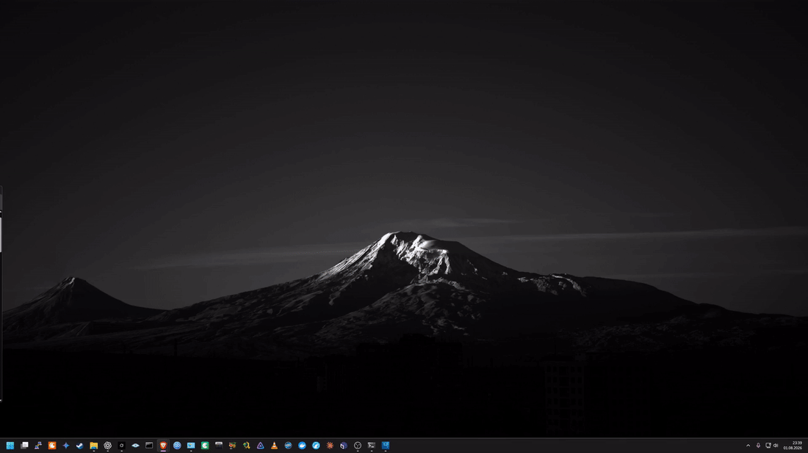
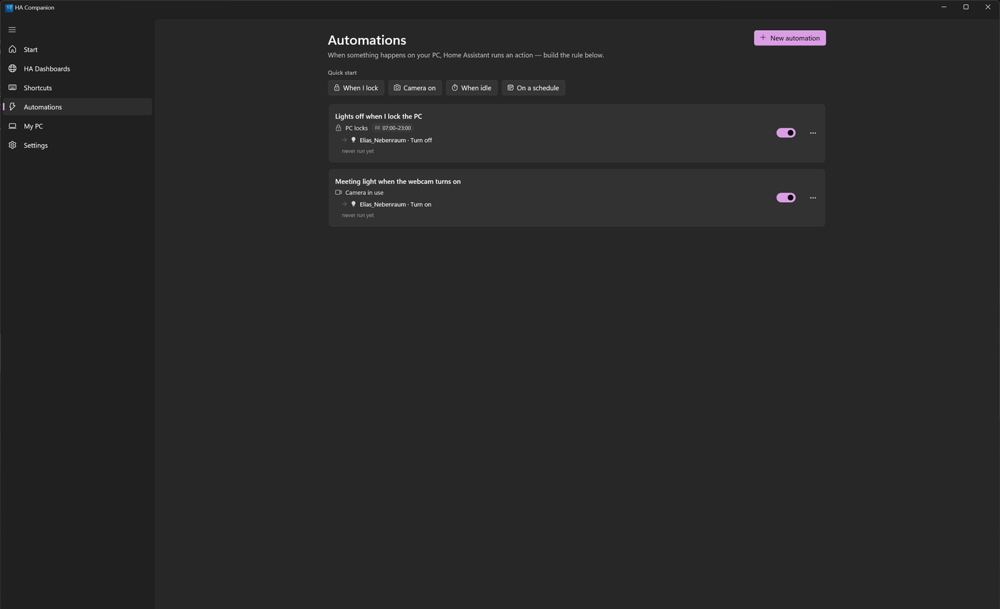
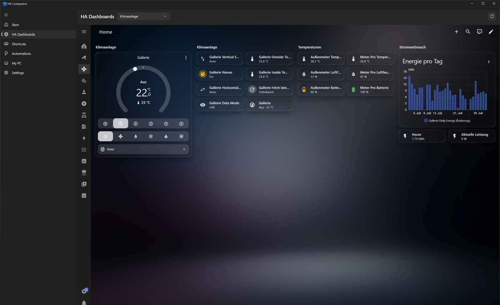

# HA Companion for Windows

[](https://hacompanion.com)
[](https://buymeacoffee.com/elias0505)
[](https://ko-fi.com/elias0505)

**Website: [hacompanion.com](https://hacompanion.com)**

A **fully native Windows 11 companion app for [Home Assistant](https://www.home-assistant.io/)** — built in C# with **.NET 9 + WinUI 3 (Windows App SDK)**. Fluent design, a dark clean UI, live REST + WebSocket integration, an editable quick-action panel opened by a global hotkey, real Home-Assistant (MDI) icons, and your actual Lovelace dashboards embedded 1:1.

*Not affiliated with or endorsed by the Home Assistant project / Nabu Casa. "Home Assistant" is a trademark of its respective owners; this app is an independent client "for Home Assistant".*

<p align="center">
  
  <br />
  <sub>One hotkey, anywhere in Windows — Home Assistant slides in over whatever you are doing.<br />
  <a href="docs/media/quick-panel-demo.mp4">Same clip as MP4</a> (sharper, 1080p)</sub>
</p>
<p align="center">
  
  
</p>
<p align="center"><b><a href="docs/SCREENSHOTS.md">More screenshots</a></b></p>

---

## Features

- **Quick panel (global hotkey)** — a configurable hotkey (default Win+Ctrl+H) slides a right-edge panel in as one unit; pick **Favourites** (editable pinned tiles) or any of your **HA dashboards** shown 1:1.
- **Auto-detected tiles** — every actionable entity becomes a tile with its **real Home Assistant icon**, grouped by domain, live via WebSocket; tap to toggle.
- **Editable & reorderable** — pin favourites, drag to reorder, add via search; layout persists.
- **HA Dashboards 1:1** — your real Lovelace dashboards embedded (WebView2), auto-logged-in with your token, no login prompt.
- **7 UI languages** — English, Deutsch, Español, Français, 中文, हिन्दी, العربية (with full right-to-left layout) — switch live in Settings.
- **Dark, clean, native** — Mica main window, borderless acrylic-free panel, adjustable panel width.
- **Live connection** — REST for actions + WebSocket for push updates (auto-reconnect).
- **System tray** — right-click → Open / Quick panel / Reconnect / Exit; closing the window hides to tray.
- **Token stored securely** — the long-lived token is encrypted with Windows DPAPI, never in plaintext.
- **Entity shortcuts** — bind any key combination to any device or script (own Shortcuts tab with category quick-pick); a clean OSD toast slides in bottom-right saying exactly what happened ("Turned on/off", live-confirmed by HA).
- **Ctrl+K launcher** — search & trigger any entity from the quick panel without touching the mouse layout.
- **Start-menu style tiles** — resize tiles freely by dragging their corner grip (1×1 up to 4×3), drag to reorder with live re-flow, optional category sections.
- **Sensor tiles** — pin read-only sensors (PV power, temperatures, …) as live value tiles.
- **Tile quick controls** — right-click a tile: brightness slider for lights, target temperature for climate, play/pause + volume for media players.
- **Windows → HA automations** — an *Automations* tab that manages your rules: **WHEN** a Windows event fires (lock/unlock, sign-in/out, sleep/resume, shutdown, display on/off, idle ≥ N min, a program becomes active, fullscreen, microphone/camera/audio, **or a time-of-day schedule on chosen weekdays**) → optional **conditions** (any number, all must hold: a time window, a **PC state** like *locked/fullscreen/mic in use*, a **numeric sensor comparison** like *temperature < 18*, or an HA entity on/off) → **THEN** one or more HA actions, optionally with **data** (light brightness/colour, media volume, target temperature, cover position, fan speed). Rules are **named, editable, duplicable and testable** ("run now"), remember when they last ran, and quick-start templates get you going in a click. Live dot shows when a trigger's state currently holds.
- **PC as an HA device** — opt-in, reports this PC to Home Assistant as a `mobile_app` device (locked, session, idle, active program, fullscreen, microphone, camera, display, audio, last start) so you can automate *in HA* on your PC's state. Privacy-first: off by default, one toggle.
- **My PC tab** — live PC status, **local notification rules** ("notify me when the front door opens / a light turns on" — no HA automation needed), HA→PC **command permissions**, and a received-notifications history.
- **HA → PC** — Home Assistant can push notifications to your PC (with **clickable action buttons** that fire events back to HA) and send **commands** (`notify.mobile_app_<pc>` with `command_lock` / `command_sleep` / `command_shutdown` / `command_monitor_off` / `command_volume` / `command_mute` / `command_launch`). Every command is individually opt-in; the risky ones (shutdown, sleep, launch) stay off until you enable them, and `command_launch` only starts programs from your whitelist.
- **Backup** — export/import your whole configuration (layout, shortcuts, automations, notification rules, settings) as one portable JSON — no secrets included.
- **HA notifications** — persistent notifications appear as native Windows toasts (optional).
- **Robust connection** — instant reconnect on network change / resume from sleep; exponential backoff resets after healthy sessions.
- **Start with Windows** — optional autostart, silently into the tray; tray icon mirrors the connection state.
- **Network discovery** — a search button finds your Home Assistant on the LAN via mDNS and fills in the URL (where multicast is allowed).
- **Diagnostics & self-repair** — a one-click redacted diagnostics report (never contains your token), an "open log folder" shortcut, and an actionable repair banner that guides you when a token is revoked or a certificate is untrusted.
- **Honest actions** — the connection is tested *before* settings are saved with a precise reason on failure (auth / DNS / TLS / timeout); failed actions surface an error instead of silently lying.
- **File logging** — app.log / crash.log under %LOCALAPPDATA%\HaCompanion for easy diagnosis.
- **Unit-tested core & strict build** — the protocol/parsing layer is covered by 300+ xunit tests run in CI; the whole solution builds warnings-as-errors with .NET analyzers.

### Planned

- Jump Lists · Windows Widgets board · MSIX packaging + signed releases (Microsoft Store)

---

## Architecture

Clean **MVVM**, split into two projects:

| Project | Target | What |
|---|---|---|
| `HaCompanion.Core` | `net9.0` (platform-neutral) | Home Assistant REST + WebSocket clients, models, connection service. No UI, unit-testable, builds on any OS. |
| `HaCompanion.App` | `net9.0-windows` (WinUI 3) | Views, ViewModels, tray, notifications, secure settings store, DI composition root. Windows-only. |

- **DI**: `Microsoft.Extensions.DependencyInjection`
- **MVVM**: `CommunityToolkit.Mvvm` (source-generated observable properties & commands)
- **Tray**: `H.NotifyIcon.WinUI`

---

## Quick install (recommended)

Paste this into **PowerShell** — it installs everything needed and launches the app. No admin rights required for the app itself (per-user install to `%LOCALAPPDATA%\Programs\HaCompanion`, Start Menu shortcut included; the app is self-contained, and the WebView2 Runtime is auto-installed via the official Microsoft bootstrapper only if missing). Run it again any time to update — your settings are kept:

```powershell
irm https://raw.githubusercontent.com/Elias0505/ha-companion-windows/main/install.ps1 | iex
```

From plain **cmd** (or the Run box):

```bat
powershell -NoProfile -Command "irm https://raw.githubusercontent.com/Elias0505/ha-companion-windows/main/install.ps1 | iex"
```

Want it to start with Windows? Just flip **Start with Windows** in the app's Settings. The environment variable below exists only for scripted/unattended installs:

```powershell
$env:HACOMPANION_AUTOSTART = '1'   # PowerShell, before the line above
```
```bat
set HACOMPANION_AUTOSTART=1        :: cmd, before the line above
```

> The binary is not code-signed yet, so Windows SmartScreen may warn on first start — click "More info" → "Run anyway". Code signing / winget / Microsoft Store are on the roadmap (see [Planned](#planned)).

## Run it from source

**Only prerequisite: the [.NET 9 SDK](https://dotnet.microsoft.com/download/dotnet/9.0).** No Visual Studio, no separate "Windows App SDK" install — WinUI 3 is restored automatically from NuGet. Windows 10 (19041+) or Windows 11.

```powershell
# from the repo root — build & launch (Debug)
./run.ps1
```

Or manually:

```powershell
dotnet run --project src/HaCompanion.App -c Debug -r win-x64 -p:Platform=x64
```

### Make a double-click .exe (nothing to install on the target PC)

```powershell
./publish.ps1
```

This produces a **self-contained** build — the resulting `HaCompanion.exe` bundles the .NET runtime *and* the Windows App SDK, so it runs on any Windows 11 PC with nothing pre-installed.

> `HaCompanion.Core` builds on Linux/macOS too (handy for CI/tests). The WinUI 3 app requires Windows.

## First run

1. Open **Settings**.
2. Enter your Home Assistant base URL (e.g. `https://homeassistant.local:8123` or `http://192.168.x.x:8123`).
3. Paste a **Long-Lived Access Token** (Home Assistant → your profile → *Long-lived access tokens* → *Create token*).
4. Connect. Pick the entities you want as quick-action tiles.

Tip: on a network with mDNS enabled, the **search button** next to the base URL finds your Home Assistant automatically.

---

## Configuration reference

Everything is configured in **Settings** — there is no config file to edit. Settings live in `%LOCALAPPDATA%\HaCompanion\settings.json`; the access token and the mobile_app webhook id are encrypted at rest with **Windows DPAPI** (per-user, per-machine — the file is useless if copied to another PC or user).

| Setting | Meaning |
|---|---|
| **Base URL** | Your HA URL, e.g. `https://homeassistant.local:8123`. |
| **Long-lived access token** | Created in HA → profile → *Long-lived access tokens*. Stored encrypted. |
| **Ignore certificate errors** | Accept a self-signed HTTPS certificate. Off by default. |
| **Language** | UI language (English, German, Spanish, French, Chinese, Hindi, Arabic — Arabic mirrors the layout right-to-left). |
| **Start with Windows** | Adds an autostart entry; the app then starts hidden in the tray. |
| **Show HA notifications** | Mirror Home Assistant persistent notifications as Windows toasts. |
| **Quick panel** | Global hotkey (default `Win+Ctrl+H`), width, default view, auto-hide, edge-resize. |
| **Report PC state (PC sensors)** | Opt-in. Publishes this PC to HA as a `mobile_app` device (see below). Off by default. |
| **Idle threshold** | Minutes of no input before the PC counts as idle. |
| **PC commands** | Per-command opt-in for HA→PC control (lock / monitor off / volume / mute / sleep / shutdown / launch). The critical ones are **off by default**; `launch` runs only whitelisted apps. |

**Backup / restore** and **Diagnostics** (a redacted report for bug reports — never contains the token or webhook) are also in Settings.

## How data flows

- **Home Assistant → app (live):** entity states arrive over the WebSocket API and update instantly; a REST snapshot loads on connect and after every reconnect. On connection loss all tiles grey out as *unavailable* rather than showing stale values.
- **App → Home Assistant (PC sensors, opt-in):** pushed on every state transition (coalesced ~500 ms) plus a 60 s heartbeat that self-heals missed updates. A final bounded push fires on lock/suspend/shutdown before the network goes away.
- **Home Assistant → app (push channel):** `notify.mobile_app_<pc>` deliveries and PC commands ride the mobile_app WebSocket push channel — **no MQTT broker required.**

## Home Assistant automation examples

With **PC sensors** enabled, your PC appears as a device with entities like `binary_sensor.<pc>_microphone_in_use`, `binary_sensor.<pc>_is_locked`, `sensor.<pc>_active_program` and `sensor.<pc>_idle_minutes`:

```yaml
# Turn on the desk light when the webcam starts (e.g. a meeting begins)
automation:
  - alias: Meeting light on
    trigger:
      - platform: state
        entity_id: binary_sensor.my_pc_camera_in_use
        to: "on"
    action:
      - service: light.turn_on
        target: { entity_id: light.desk }
```

The reverse direction — **Windows → HA** — lives entirely in the app's *Automations* tab (no YAML): e.g. *WHEN the camera turns on, ONLY IF after 18:00 and the PC is not locked, THEN turn the desk light on at 30 %*, or *every weekday at 07:00, turn on the office*. Rules run locally on your PC and call HA over its API.

Send a notification **to** the PC (a toast, optionally with action buttons), or a command the PC executes when you allow it in *My PC*:

```yaml
# A toast on the PC
- service: notify.mobile_app_my_pc
  data:
    title: "Laundry done"
    message: "Move it to the dryer"

# Lock the PC (requires the "lock" command to be enabled in My PC)
- service: notify.mobile_app_my_pc
  data:
    message: "command_lock"
```

## Troubleshooting

| Symptom | Fix |
|---|---|
| **"Access denied — the token was rejected."** | The token is wrong or was revoked. Create a new long-lived token in HA and paste it. |
| **"Host not found — check the base URL."** | Typo in the URL, or DNS can't resolve the host. |
| **"Certificate error…"** | Self-signed HTTPS: enable *Ignore certificate errors*. |
| **"Home Assistant did not respond (timeout)."** | HA isn't running or a firewall/port blocks it. |
| A warning banner appears at the top | It only shows for a revoked token or a certificate problem — click **Open settings** to fix it. |
| `notify.mobile_app_<pc>` doesn't exist in HA | Enable **Report PC state**, connect, and let it register once. The service appears on fresh registration. |
| Something's wrong and you want to report it | Settings → **Diagnostics → Export report** (secrets are redacted), and attach it. |

Logs live in `%LOCALAPPDATA%\HaCompanion\` (`app.log`, `crash.log`) — *Open log folder* is in the Diagnostics card.

## Known limitations

- **No MQTT.** This app uses the HA `mobile_app` API by design (no broker, no YAML). Features that require a real `media_player` entity are out of scope.
- **`is_locked` has no `lock` device class** on purpose: Home Assistant's `lock` binary class means *on = unlocked*, which would invert the meaning; the sensor stays a plain binary_sensor (`on = locked`).
- **Network discovery needs mDNS.** If your network blocks/disables multicast, the search finds nothing — just enter the URL manually.
- **The PC-sensor entities are enabled by default** (all 11 are core to the app's purpose); turn the whole feature off in Settings to hide them in HA.
- **Windows only** (Windows 10 19041+ / Windows 11). The `HaCompanion.Core` library is cross-platform, but the app is WinUI 3.

## Removing the app

Installed with the one-liner? Then it's a normal entry in **Settings → Apps → Installed apps** — click **Uninstall** there (the Start menu's right-click → *Uninstall* and the old *Programs and Features* lead to the same place). That removes the program folder, the Start-menu shortcut, the autostart entry and the notification registration, and asks once whether your settings and token should go as well — answer *No* to keep them for a later reinstall.

The same uninstaller can be run directly, which is also how you script it:

```powershell
& "$env:LOCALAPPDATA\Programs\HaCompanion\uninstall.ps1"             # asks about your data
& "$env:LOCALAPPDATA\Programs\HaCompanion\uninstall.ps1" -KeepData   # keeps settings and token
& "$env:LOCALAPPDATA\Programs\HaCompanion\uninstall.ps1" -Silent     # no questions, removes everything
```

Two things it deliberately leaves alone:

- **The `mobile_app` device in Home Assistant.** Only HA can delete that: Settings → Devices & Services → *Mobile App* → your PC → delete. Without this, its (now dead) sensors stay in HA.
- **The WebView2 runtime**, because it is shared with other apps on your PC.

**Just want a clean slate?** No need to uninstall: Settings → **Reset to factory settings** deletes the configuration, token, tiles, rules and logs, switches autostart off and restarts the app in its first-run state. If anything is worth keeping, export a backup first (Settings → *Back up configuration → Export*).

Running a copy you built or unzipped yourself? Windows knows nothing about it: quit from the tray, delete the folder, delete `%LOCALAPPDATA%\HaCompanion`, and — if you enabled autostart — the `HaCompanion` value under `HKEY_CURRENT_USER\Software\Microsoft\Windows\CurrentVersion\Run`.

---

## License

**GNU Affero General Public License v3.0 only (AGPL-3.0-only).** See [`LICENSE`](LICENSE).

In short: you may use, study, share and modify this software freely — but **if you distribute it or run a modified version as a network service, you must release your complete corresponding source under the AGPL as well.** This deliberately prevents anyone from taking this code, closing it, and reselling it as a proprietary product.

### Commercial / proprietary use

Want to use this in a **closed-source or commercial product** without the AGPL's copyleft obligations? That requires a **separate commercial license** — please get in touch. See [`COMMERCIAL.md`](COMMERCIAL.md).

## Contributing

Contributions are welcome! By contributing you agree to the **Developer Certificate of Origin** and to license your contribution under the project's terms so the maintainer can keep offering commercial licenses. See [`CONTRIBUTING.md`](CONTRIBUTING.md).

## Credits

Entity icons use the [Material Design Icons](https://pictogrammers.com/library/mdi/) webfont (Apache-2.0). See [`THIRD-PARTY-NOTICES.md`](THIRD-PARTY-NOTICES.md) for all bundled/third-party components and their licenses.
