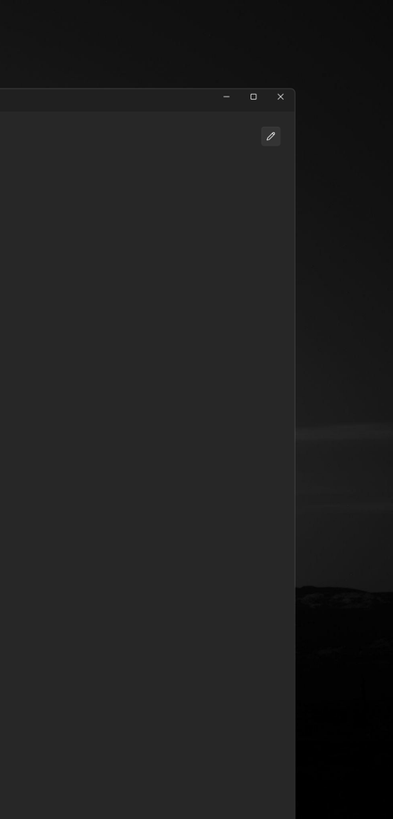
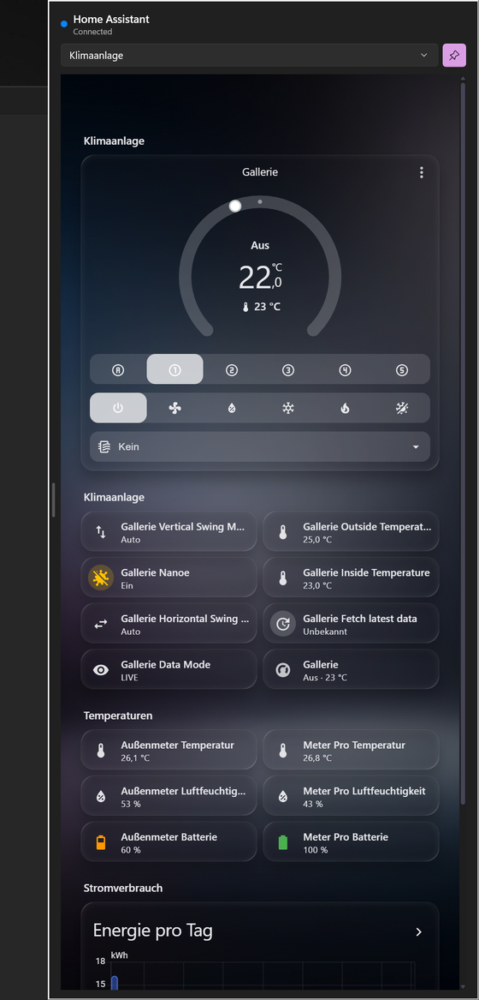
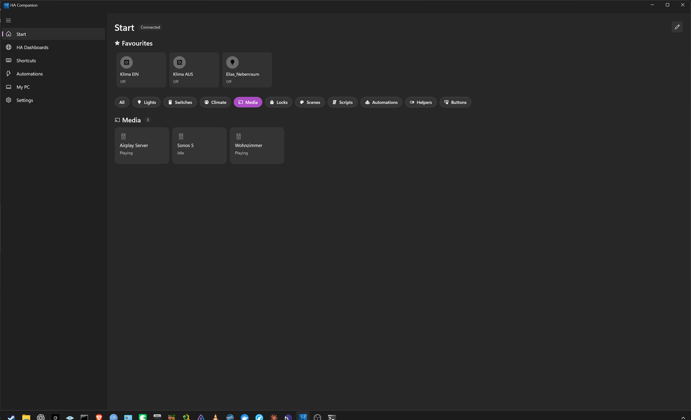
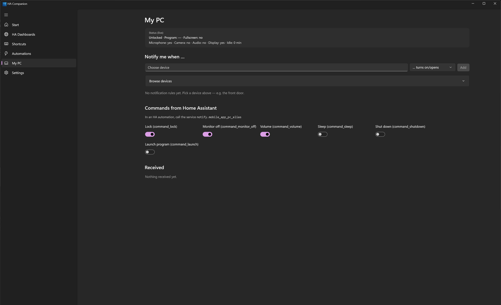
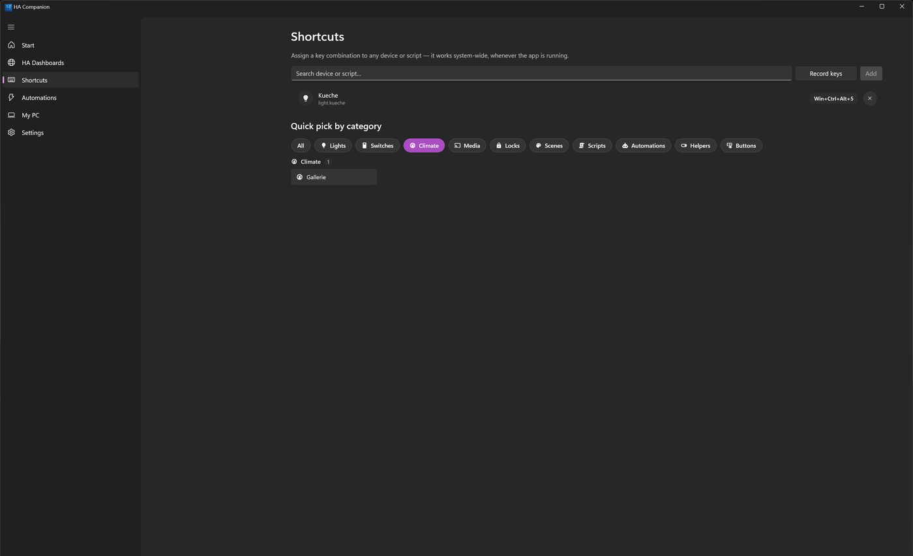
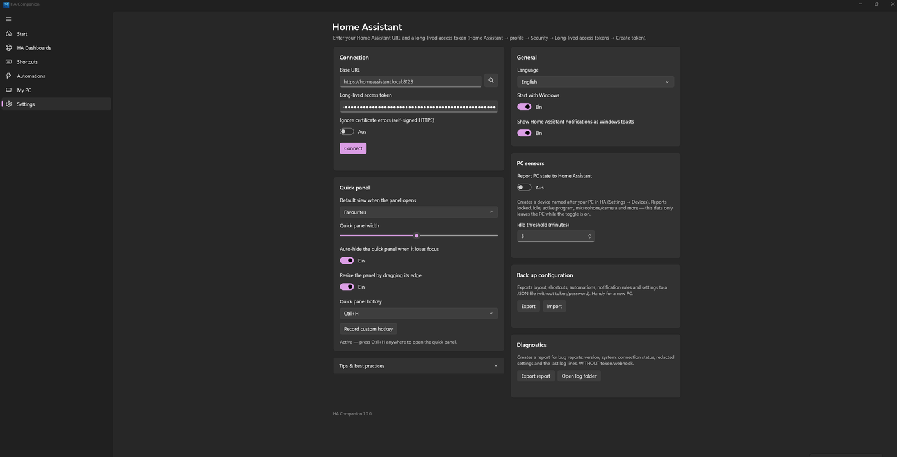

# Screenshots

A tour through HA Companion for Windows. All shots were taken on Windows 11 (dark theme) against a real Home Assistant installation.

## Quick panel

Press the global hotkey (default `Win+Ctrl+H`) anywhere in Windows and your Home Assistant slides in over whatever you are doing — pinnable, resizable, and gone again with the same hotkey. No window to find, no browser tab.

Recorded on a real 4K desktop at 60 fps (GPU capture), replayed here at 40 fps.
**[Same clip as MP4](media/quick-panel-demo.mp4)** if you want it sharper.

Close-up of the panel itself:

The panel can show your favourite entity tiles or a full Lovelace dashboard of your choice:

## Start

Favourites, category filters and live tiles for every entity Home Assistant exposes:

## Windows → HA automations

Build rules like "when the webcam turns on, set the meeting light" or "when I lock the PC, turn everything off" — triggered by real Windows events (lock/unlock, idle, fullscreen, mic/camera use, power state, schedules):

## My PC — the PC as a Home Assistant device

The app registers your PC via the `mobile_app` integration: 11 live sensors (locked, idle, mic/camera in use, foreground app, ...) plus opt-in commands Home Assistant can send back — lock, sleep, volume, monitor off and more:

## Shortcuts

Assign a system-wide key combination to any device, scene or script:

## HA Dashboards

Your full Lovelace dashboards, rendered 1:1 in a native window (WebView2) — switchable per dashboard:

## Settings

Everything lives on one page: the connection (base URL, long-lived token, optional self-signed certificate), the quick panel (default view, width, auto-hide, hotkey), language and autostart, the opt-in PC sensors, a token-free configuration backup, and a redacted diagnostics report:

The token is only ever shown masked and is stored encrypted with Windows DPAPI — it never appears in the backup or in a diagnostics report.
